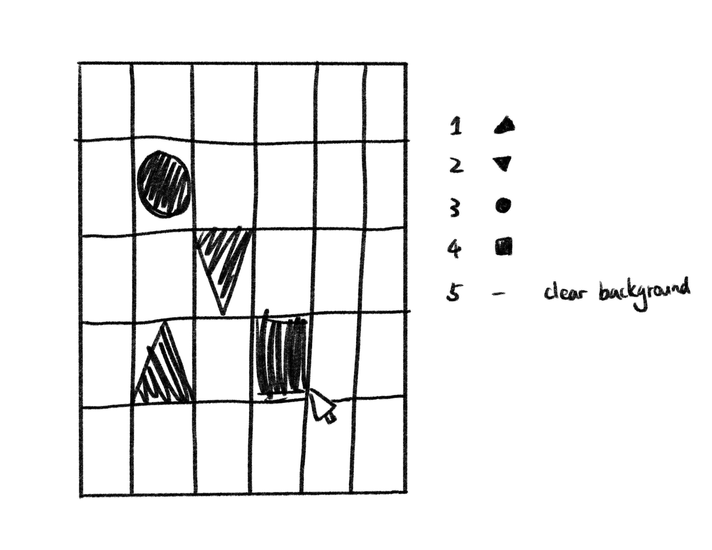

## Summary
This is a code which creates an interactive grid of shapes that can be changed by mouseclicking on them.(depends on how many times you click)

## Plan
I decided to do a playful and interactive board that can be used for DIY pattern making. By clicking different times, the shapes in the block will be changed. Here is a sketch that I did first to clarify what I to do next.

Here are the steps for reference:
1. Use for() function to draw a loop of rect to create a canvas with grids.(make sure the grid positions and shapes can be initialized)
2. Inside draw() function, there is a loop that iterates through each grid cell:
   - It draws a hollow grid rectangle.
   - It checks the value in gridShapes for each grid and draws the corresponding shape (triangle, circle, or rectangle) if applicable.
3. mousePressed() funtion to determine times and shapes, and check if the mouse click is inside any of the grid. It is cycling through values 0 to 4 (modulus 5) to change the shape.

## Hard & Fun
I think the fun part for writing this code is combining what we learned before that using for() function to create the loop as the basic canvas of this code. And also calculating the accurate position of each shape inside the grid is a little complex and need to be tested for several times.